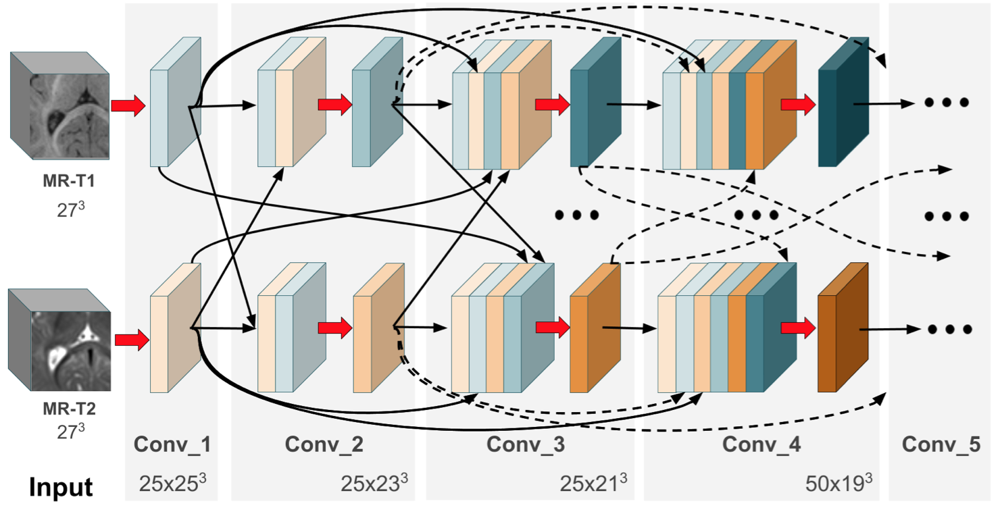

# Hyperdensenet_Pytorch


This is a Pytorch implementation of Hyperdensenet. For the detailed architecture please refer to the original paper: [link](https://arxiv.org/abs/1804.02967)

This is not the original implementation of the paper (Do not use it to reproduce the results). The original code is based on Theano and can be found [here](https://github.com/josedolz/HyperDenseNet)

### Design of the Proposed Model


### Dependencies
This code depends on the following libraries:

- Python >= 3.5
- Pytorch 0.3.1 (Testing on more recent versions)
- nibabel
- medpy


### Training

The model can be trained using below command:  
```
python mainHyperDenseNet.py
```

## Preparing your data
- To use your own data, you will have to specify the path to the folder containing this data (--root_dir).
- Images have to be in nifti (.nii) format
- You have to split your data into two folders: Training/Validation. Each folder will contain N sub-folders: N-1 subfolders that will contain each modality and GT, which contain the nifti files for the images and their corresponding ground truths. Then, for training, you only need to specify which subfolders you want to use in the command line. For example:
```
--modality_dirs T1 T2_FLAIR
```
- Image names should be the same across folders (e.g., )
## Current version
- The current version includes HyperDenseNet for 2 and 3 modalities. To run either one or the other, you simply need to specify the number of modalities on the input arg numModal
```
--numModal n
```
where n is the number of modalities.
- Patch size, and sampling steps values are hard-coded. We will work on a generalization of this, allowing the user to decide the input patch size and the frequency to sample the patches.
- We are working on adding an external testing function.
- In the original paper we used a ROI to mask out the background. This will help during sampling patches for training, as well as remove outliers on the testing images, since the receptive field of this network is small.

If you use this code in your research, please consider citing the following paper:

Dolz J, Gopinath K, Yuan J, Lombaert H, Desrosiers C, Ayed IB. HyperDense-Net: A hyper-densely connected CNN for multi-modal image segmentation. IEEE transactions on medical imaging. 2018 Oct 30;38(5):1116-26.

# HyperDenseNet_pytorch
